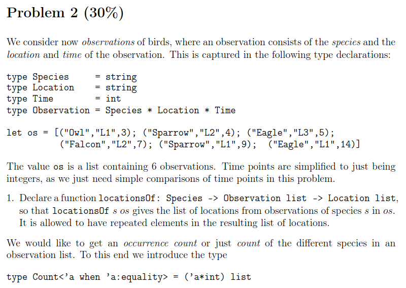
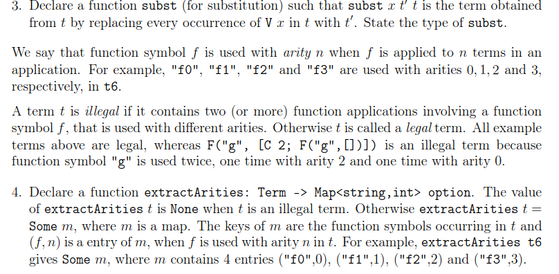

# FSharp Exam Notes

## Type Inference

### Examples

#### 1. 
**Consider the declarations:**

```fsharp
// 1
let rec f = function
| (x, []) -> []
| (x, y::ys) -> (x+y)::f(x-1, ys);;

// 2
let rec g = function
| [] -> []
| (x,y)::s -> (x,y)::(y,x)::g s;;

// 3
let rec h = function
| [] -> []
| x::xs -> x::(h xs)@[x];;
```

**Find the types for f, g and h and explain the value of the expressions:**
1. f(x, [y0,y1, . . . ,yn−1]), n ≥ 0
2. g[(x0, y0),(x1, y1), . . . ,(xn−1, yn−1)], n ≥ 0
3. h[x0,x1, . . . ,xn−1], n ≥ 0

<hr/>

**Function 1** 

1.  ```Function``` indicates that the type of ```q``` is $\tau -> \tau '$.  
2.  The tuple means that $\tau$ must have the form $t_1 * t_2$ for some types $t_1$ and $t_2$
3.  $x-1$ means that $t_1$ must be of type ```int``` since $1$ is of type ```int```.
4.  $x+y$ means that $t_2$ must also be of type ```int```. Since $t_2$ is a list, $t_2$ is of type ```int list```.
5.  Since $\tau'$ is a list of products of $t_1$ and $t_2$ computations, it must also me of type ```int list```
6.  The type of ```q``` is ```int * int list -> int list```

**Function 2**

1. ```Function``` indicates that the type of ```g``` is $\tau -> \tau'$.
2. The function takes one argument meaning that $\tau$ must have the form $t_1$ for some type $t_1$.
3. $t_1$ is presented by ```(x,y)::s``` so $t_1$ must be a list of tuples.
4. The product is also a list of tuples, and there are no indications of strong typing. Due to the product being ```(x,y)::(y,x)::g s;;``` where ```x``` and ```y``` share the same spots in the tuple, ```x``` and ```y``` must be of the same type.
5. We know that $\tau$ and $\tau'$ are both lists of tuples, that the tuple units must be of the same type **and** that there has been no sign of strong typing. The tuples are therefore of types ```('a * 'a)```, and both $\tau$ and $\tau'$ are of types ```('a * 'a) list```.
6. ```g``` is of type ```('a * 'a) list -> ('a * 'a) list```

**Function 3**
1. ```Function``` indicates that the type of ```h``` is $\tau -> \tau'$.
2. The function takes one argument meaning that $\tau$ must have the form $t_1$ of some type $t_1$.
3. ```[]``` and ```x::xs``` means that $t_1$ must be a list of some type ```'a```.
4. ```x::(h xs)@[x]``` means that $\tau'$ must also be a list of some type ```'a```.
5. We know that $\tau$ and $\tau'$ are both of type ```a' list``` **and** there are no indications of ```'a``` being strongly typed.
6. ```h``` is of type ```'a list -> 'a list```.

## Tail recursion

Iterative (tail-recursive) functions is a simple technique to deal
with efficiency in certain situations, for example, in order

* to avoid evaluations with a huge amount of pending operations, e.g.
7+(6+(5 · · · +f 2 · · · ))
* to avoid inadequate use of @ in recursive declarations.

Iterative functions with accumulating parameters correspond to
while-loops.

Consider the following declaration:
```fsharp
let rec fact =
    function
    | 0 -> 1
    | n -> n * fact(n-1);;
val fact : int -> int
```
**Evaluation:**

$\rArr$ `fact(N)` <br>
$\rArr$ `(n * fact(n-1) , [n 7→ N]) `<br>
$\rArr$ `N ∗ fact(N − 1)` <br>
$\rArr$ `N ∗ (n * fact(n-1) , [n 7→ N − 1])` <br>
$\rArr$ `N ∗ ((N − 1) ∗ fact(N − 2))` <br>
.<br>
.<br>
$\rArr$ `N ∗ ((N − 1) ∗ ((N − 2) ∗ (· · · (4 ∗ (3 ∗ (2 ∗ 1))) · · · )))` <br>
$\rArr$ `N ∗ ((N − 1) ∗ ((N − 2) ∗ (· · · (4 ∗ (3 ∗ 2)) · · · )))` <br>
. <br>
. <br>
N!

Time and space demands proportional to N. Is that satisfactory?

Another naive example:

```fsharp
let rec naiveRev =
    function
    | [] -> []
    | x::xs -> naiveRev xs @ [x];;
val naiveRev : ’a list -> ’a list
```
**Evaluation of `naiveRev [x 1 , x 2 , . . . , x n ]:`**

$\rArr$ `naiveRev [x 1 , x 2 , . . . , x n ]`<br>
$\rArr$ `naiveRev [x 2 , . . . , x n ]@[x 1 ]`<br>
$\rArr$ `(naiveRev [x 3 , . . . , x n ]@[x 2 ])@[x 1 ]`<br>
. <br>
. <br>
$\rArr$ ```((· · · (([ ]@[x n ])@[x n−1 ])@ · · · @[x 2 ])@[x 1 ])```

**Space demands: proportional to $n$ (satisfactory). <br> Time demands: proportional to $n^2$ (NOT satisfactory)**

Efficient solutions are obtained by using more general functions:

$factA(n, m) = n! * m$, for $n \ge 0$

$revA([x_1, ...., x_n], ys) = [x_n, ..., x_1] @ ys$

We have: 

$n! = factA(n, 1)$

$rev[x_1, ..., x_n] = revA([x_1, ..., x_n], [])$

`m` and `ys` are `accumulating parameters`. They are used to hold the temporary result during the evalution.

The declarations of `factA` and `revA` are `tail-recursive functions`

### Tail recursive version of fact(n)
Property: $factA(n, m) = n! · m$, for $n ≥ 0$

```fsharp
let rec factA =
    function
    | (0,m) -> m
    | (n,m) -> factA(n-1,n*m)
```

**Evaluation**

$\rArr$ `factA(5,1)`<br>
$\rArr$ `(factA(n-1,n*m), [n 7→ 5, m 7→ 1])`<br>
$\rArr$ `factA(4,5)`<br>
$\rArr$ `(factA(n-1,n*m), [n 7→ 4, m 7→ 5])`<br>
$\rArr$ `factA(3,20)`<br>
...<br>
$\rArr$ `factA(0,120)`<br>
$\rArr$ `(m, [m 7→ 120])` $\rArr$ `120`

**Space demand: constant.** <br>
**Time demands: proportional to n**

## Tail recursion version of revA
Property: `revA([x 1 , . . . , x n ], ys) = [x n , . . . , x 1 ] @ys`

```fsharp
let rec revA =
    function
    | ([], ys)
    -> ys
    | (x::xs, ys) -> revA(xs, x::ys)
```
**Evaluation**

`revA([1,2,3],[])`<br>
$\rArr$ `revA([2,3],1::[])`<br>
$\rArr$ `revA([3],2::[1])`<br>
$\rArr$ `revA([3],[2,1])`<br>
$\rArr$ `revA([],3::[2,1])`<br>
$\rArr$ `revA([],[3,2,1])`<br>
$\rArr$ `[3,2,1]`

**Space and time demands proportional to n**

* the recursive call is the last function application to be evaluated
in the body of the declaration e.g. facA(3, 20) and
revA([3], [2, 1])
* only one set of bindings for argument identifiers is needed
during the evaluation

### Continuation in the context  of tail-recursion

Continuation is a representation of the "rest" of the computation. Instead of using an accumulator variable, a continuation function (which serves as an accumulator), can be built up during the recursion.
For example, `sum` is not tail-recursive:

```fsharp
let rec sum xs = match xs with
    | [] -> 0
    | x::rst -> x + sum rst;;

sumC [1..4];;
val it : int = 10
```

We can make `sum` tail-recursive by adding a continuation function to store the calculations:

```fsharp
let rec sum k = match xs with
    | [] -> k 0
    | x::rst -> sum rst fun(v -> k(x+v));;

sum [1..4] fun(v -> 0+v);;
val it : int = 10
```

**This evaluates to**

$\rArr$ sumC `[1;2;3] id `<br>
$\rArr$ sumC `[2;3] (fun v -> id(1+v))`<br>
$\rArr$ sumC `[3] (fun w -> (fun v -> id(1+v))(2+w))`<br>
$\rArr$sumC `[] (fun u -> (fun w -> (fun v -> id(1+v))(2+w))(3+u))`<br>
$\rArr$ `(fun u -> (fun w -> (fun v -> id(1+v))(2+w))(3+u)) 0`<br>
$\rArr$ `(fun w -> (fun v -> id(1+v))(2+w)) 3`<br>
$\rArr$ `(fun v -> id(1+v)) 5`<br>
$\rArr$ `id 6`<br>
$\rArr$ `6`<br>

Important:
* `Closures` are allocated in the heap
* Just one stack frame is needed due to tail calls
* Stack is traded for heap


# Eksamen dec 20, 2017

## Problem 1.


## Problem 2.



## Problem 3.


## Problem 4.


## Problem 5.


