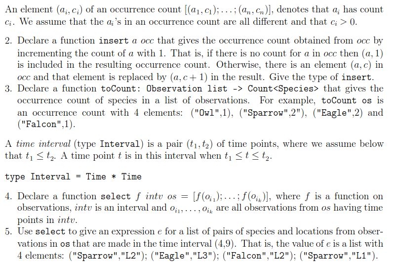

## Tail recursion

Iterative (tail-recursive) functions is a simple technique to deal
with efficiency in certain situations, for example, in order

* to avoid evaluations with a huge amount of pending operations, e.g.
7+(6+(5 · · · +f 2 · · · ))
* to avoid inadequate use of @ in recursive declarations.

Iterative functions with accumulating parameters correspond to
while-loops.

Consider the following declaration:
```fsharp
let rec fact =
    function
    | 0 -> 1
    | n -> n * fact(n-1);;
val fact : int -> int
```
**Evaluation:**

$\rArr$ `fact(N)` <br>
$\rArr$ `(n * fact(n-1) , [n 7→ N]) `<br>
$\rArr$ `N ∗ fact(N − 1)` <br>
$\rArr$ `N ∗ (n * fact(n-1) , [n 7→ N − 1])` <br>
$\rArr$ `N ∗ ((N − 1) ∗ fact(N − 2))` <br>
.<br>
.<br>
$\rArr$ `N ∗ ((N − 1) ∗ ((N − 2) ∗ (· · · (4 ∗ (3 ∗ (2 ∗ 1))) · · · )))` <br>
$\rArr$ `N ∗ ((N − 1) ∗ ((N − 2) ∗ (· · · (4 ∗ (3 ∗ 2)) · · · )))` <br>
. <br>
. <br>
N!

Time and space demands proportional to N. Is that satisfactory?

Another naive example:

```fsharp
let rec naiveRev =
    function
    | []
    -> []
    | x::xs -> naiveRev xs @ [x];;
val naiveRev : ’a list -> ’a list
```
**Evaluation of `naiveRev [x 1 , x 2 , . . . , x n ]:`**

$\rArr$ `naiveRev [x 1 , x 2 , . . . , x n ]`<br>
$\rArr$ `naiveRev [x 2 , . . . , x n ]@[x 1 ]`<br>
$\rArr$ `(naiveRev [x 3 , . . . , x n ]@[x 2 ])@[x 1 ]`<br>
. <br>
. <br>
$\rArr$ ```((· · · (([ ]@[x n ])@[x n−1 ])@ · · · @[x 2 ])@[x 1 ])```

**Space demands: proportional to $n$ (satisfactory). <br> Time demands: proportional to $n^2$ (NOT satisfactory)**

Efficient solutions are obtained by using more general functions:

$factA(n, m) = n! * m$, for $n \ge 0$

$revA([x_1, ...., x_n], ys) = [x_n, ..., x_1] @ ys$

We have: 

$n! = factA(n, 1)$

$rev[x_1, ..., x_n] = revA([x_1, ..., x_n], [])$

`m` and `ys` are `accumulating parameters`. They are used to hold the temporary result during the evalution.

The declarations of `factA` and `revA` are `tail-recursive functions`

### Tail recursive version of fact(n)
Property: $factA(n, m) = n! · m$, for $n ≥ 0$

```fsharp
let rec factA =
    function
    | (0,m) -> m
    | (n,m) -> factA(n-1,n*m)
```

**Evalution**

$\rArr$ `factA(5,1)`<br>
$\rArr$ `(factA(n-1,n*m), [n 7→ 5, m 7→ 1])`<br>
$\rArr$ `factA(4,5)`<br>
$\rArr$ `(factA(n-1,n*m), [n 7→ 4, m 7→ 5])`<br>
$\rArr$ `factA(3,20)`<br>
...<br>
$\rArr$ `factA(0,120)`<br>
$\rArr$ `(m, [m 7→ 120])` $\rArr$ `120`

**Space demand: constant.** <br>
**Time demands: proportional to n**

## Tail recursion version of revA
Property: `revA([x 1 , . . . , x n ], ys) = [x n , . . . , x 1 ] @ys`

```fsharp
let rec revA =
    function
    | ([], ys)
    -> ys
    | (x::xs, ys) -> revA(xs, x::ys)
```
**Evaluation**

`revA([1,2,3],[])`<br>
$\rArr$ `revA([2,3],1::[])`<br>
$\rArr$ `revA([3],2::[1])`<br>
$\rArr$ `revA([3],[2,1])`<br>
$\rArr$ `revA([],3::[2,1])`<br>
$\rArr$ `revA([],[3,2,1])`<br>
$\rArr$ `[3,2,1]`

**Space and time demands proportional to n**

* the recursive call is the last function application to be evaluated
in the body of the declaration e.g. facA(3, 20) and
revA([3], [2, 1])
* only one set of bindings for argument identifiers is needed
during the evaluation

# Eksamen dec 20, 2017

## Problem 1.


## Problem 2.



## Problem 3.


## Problem 4.


## Problem 5.

